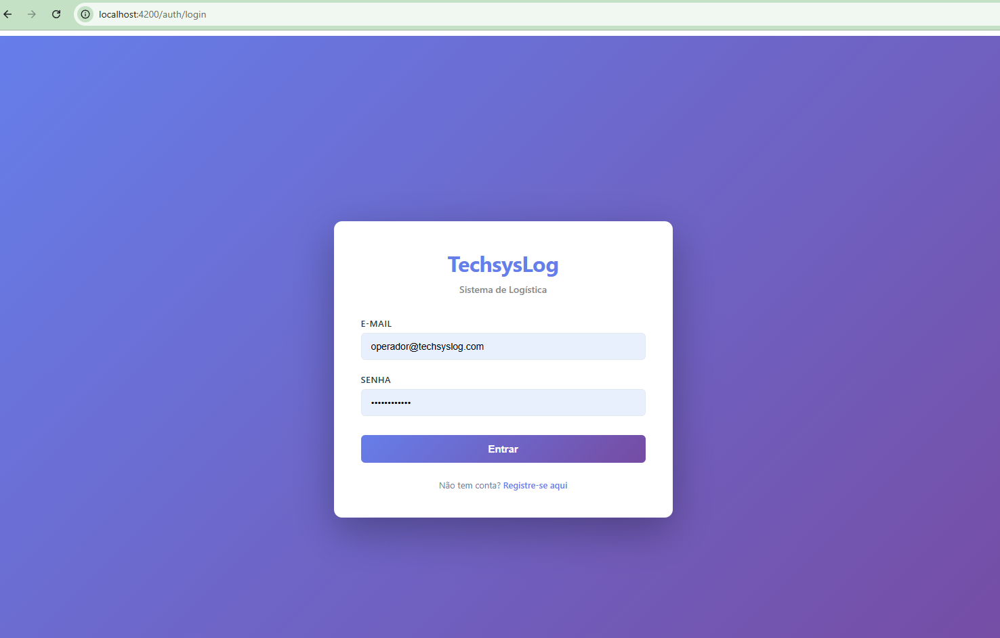
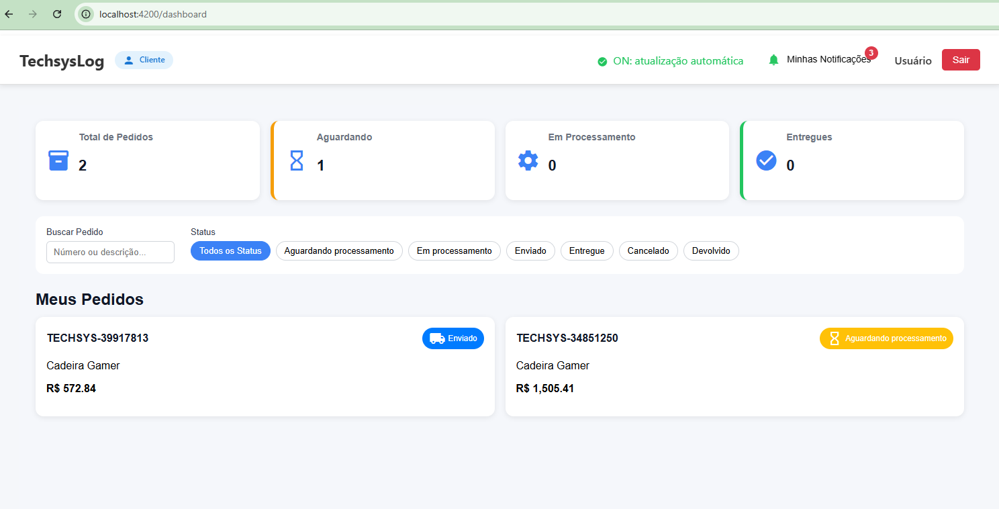
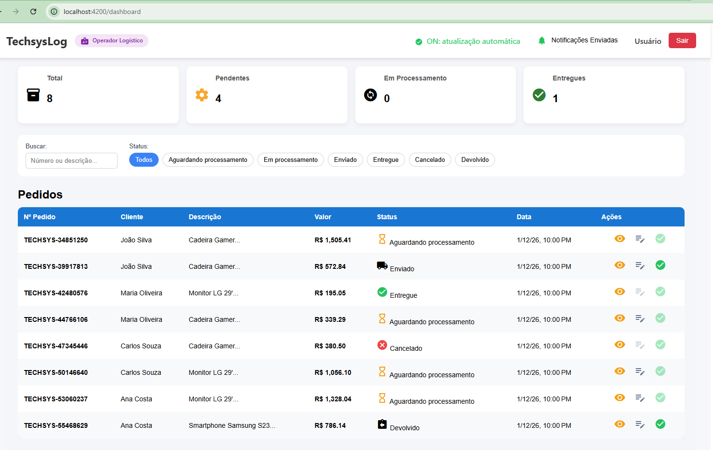
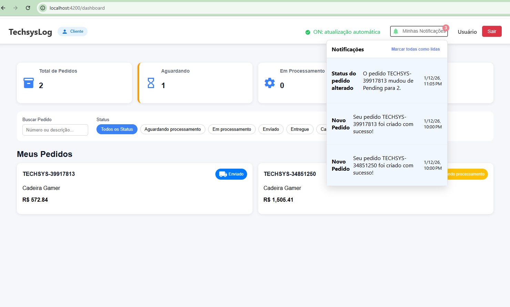
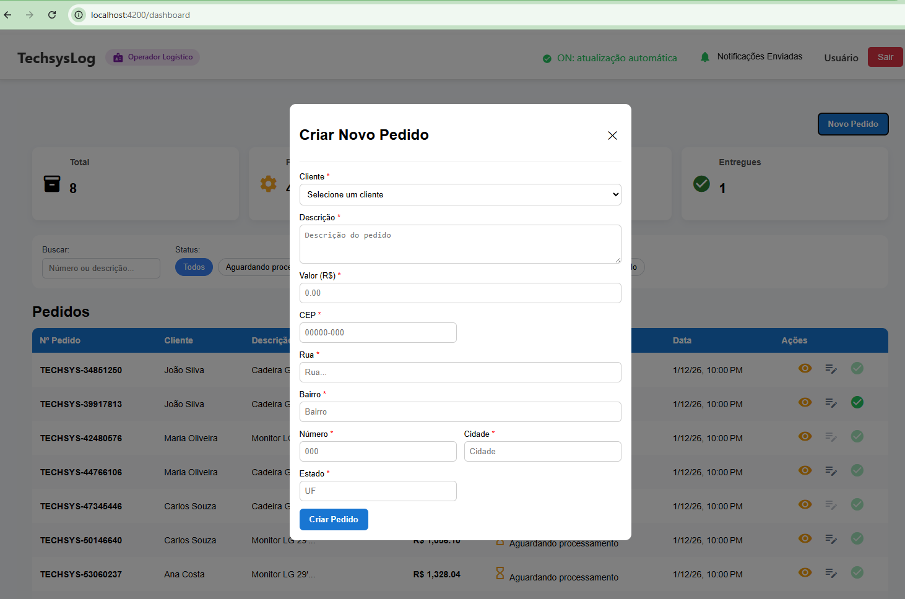
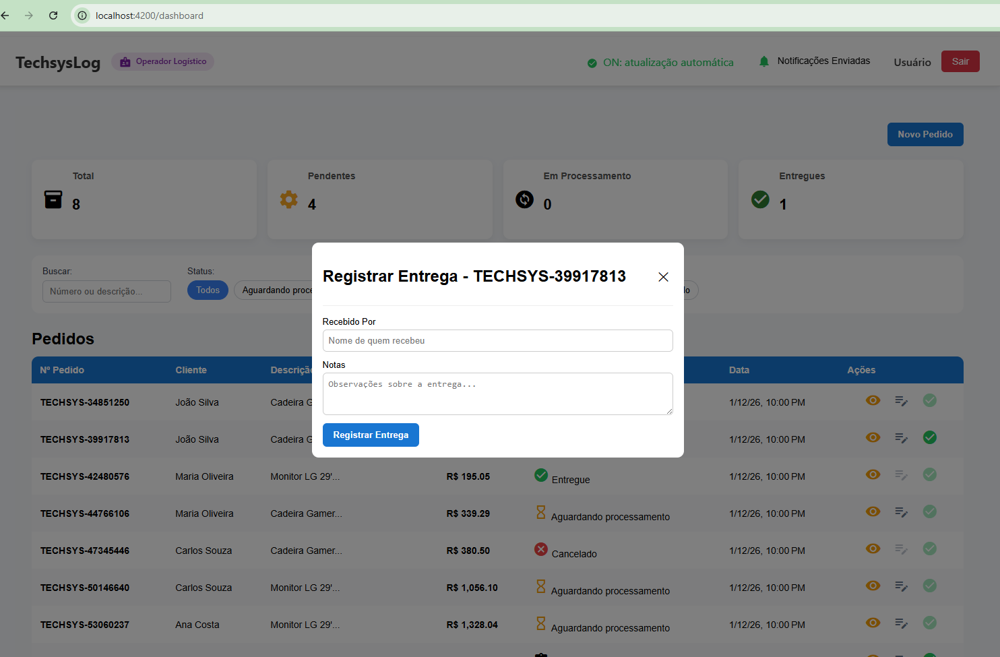
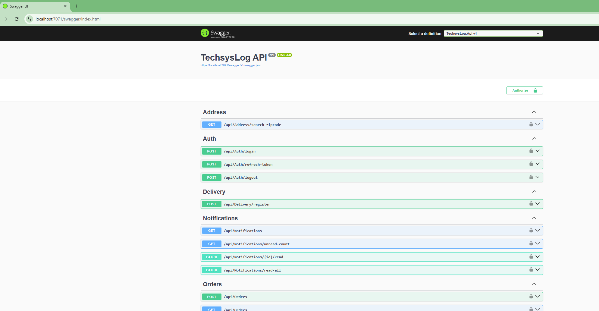
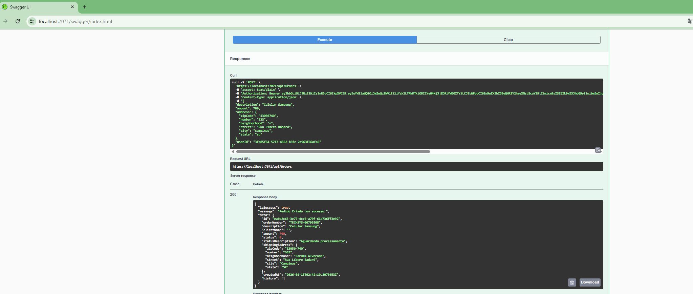
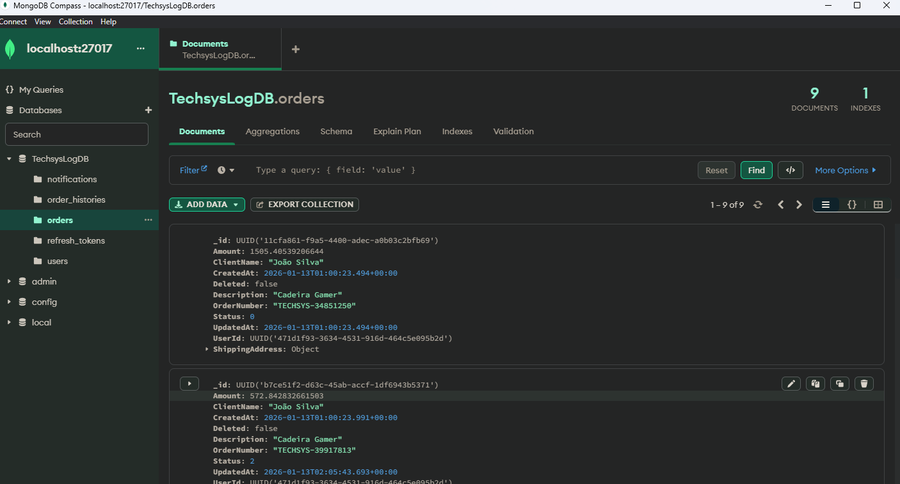

# 🚀 TechsysLog - Sistema de Controle de Pedidos e Entregas

<div align="center">


**Plataforma completa de logística com notificações em tempo real** 📦✨

[🔗 Documentação Completa](#documentação) • [⚙️ Instalação](#instalação) • [📚 API Reference](#api-reference) • [🏗️ Arquitetura](#arquitetura)

</div>

---

## 📋 Sobre o Projeto

TechsysLog é uma plataforma web moderna para gerenciamento de pedidos e acompanhamento de entregas em tempo real. Desenvolvida com tecnologias de ponta, oferece uma experiência seamless para clientes e operadores logísticos.

### ✨ Destaques

- ✅ **Autenticação JWT** com Refresh Tokens para segurança máxima
- ✅ **Notificações em Tempo Real** via SignalR
- ✅ **API RESTful** bem documentada com OpenAPI/Swagger
- ✅ **Clean Architecture** com separação clara de responsabilidades
- ✅ **Integração com ViaCEP** para validação automática de endereços
- ✅ **Sistema de Roles** (Cliente, Operador, Admin)
- ✅ **Rastreamento de Histórico** de pedidos e entregas
- ✅ **Interface Responsiva** com Angular 16+
- ✅ **MongoDB** para flexibilidade e escalabilidade

---

## 🖼️ Galeria de Screenshots
### 🔐 Tela de Login

*Interface de autenticação com JWT - Acesso seguro para clientes e operadores*

### 📊 Dashboard do Cliente

*Painel principal do cliente mostrando histórico de pedidos com status em tempo real via SignalR*
<details>
<summary>📱 <strong>Interface do Usuário</strong> (Clique para expandir)</summary>

### 👨‍💼 Dashboard do Operador

*Interface de gestão para operadores logísticos com controle total de pedidos*

### 🔔 Painel de Notificações

*Sistema de notificações em tempo real com marcação de lidas e contador de não lidas*

### 📦 Criação de Pedido

*Formulário inteligente com busca de CEP automática via API ViaCEP*

### 📦 Mudar Status de Pedido

*Alterar status do pedido*

### 📦 Efetuar entrega d Pedido

*Alterar status do pedido*

</details>

<details>
<summary>🔌 <strong>Backend e API</strong> (Clique para expandir)</summary>

### 📖 API Documentation - Swagger

*OpenAPI/Swagger com documentação completa de todos os endpoints*

### ✅ Exemplo de Response - Criar Pedido

*Exemplo de resposta bem-sucedida da API com Business Result Pattern*

### 🗄️ Banco de Dados - MongoDB

*Mongo Express mostrando collections de usuários, pedidos e notificações*

</details>

---

## 🛠️ Stack Tecnológico

### Backend
| Tecnologia | Versão | Propósito |
|-----------|--------|----------|
| **.NET Core** | 7.0+ | Framework principal |
| **Entity Framework Core** | Latest | ORM com MongoDB |
| **SignalR** | - | Comunicação em tempo real |
| **JWT Bearer** | - | Autenticação |
| **BCrypt.Net** | - | Hash seguro de senhas |
| **MongoDB** | Latest | Banco de dados NoSQL |

### Frontend
| Tecnologia | Versão | Propósito |
|-----------|--------|----------|
| **Angular** | 16+ | Framework principal |
| **TypeScript** | Latest | Tipagem estática |
| **RxJS** | - | Programação reativa |
| **Tailwind CSS** | - | Estilização |
| **Angular SignalR** | - | Cliente realtime |

---

## 📦 Estrutura do Projeto

```
TechsysLog/
│
├── 📁 backend/
│   ├── 📁 src/
│   │   ├── 🎯 TechsysLog.Api/
│   │   │   ├── Controllers/          # Endpoints da API
│   │   │   ├── Middleware/           # Middleware customizado
│   │   │   ├── Extensions/           # Extensões de configuração
│   │   │   ├── appsettings.json
│   │   │   └── Program.cs
│   │   │
│   │   ├── 💼 TechsysLog.Application/
│   │   │   ├── Services/             # Lógica de negócios
│   │   │   ├── DTOs/                 # Data Transfer Objects
│   │   │   ├── Interfaces/           # Contratos de serviços
│   │   │   ├── Mappers/              # Mapeamento de entidades
│   │   │   ├── Hubs/                 # SignalR Hubs
│   │   │   ├── Seed/                 # Dados iniciais
│   │   │   └── Common/               # Classes compartilhadas
│   │   │
│   │   ├── 🏗️ TechsysLog.Domain/
│   │   │   ├── Entities/             # Entidades de negócios
│   │   │   ├── Enums/                # Enumerações
│   │   │   └── Interfaces/           # Contratos de repositório
│   │   │
│   │   ├── 🔌 TechsysLog.Infrastructure/
│   │   │   ├── Data/
│   │   │   │   ├── Context/          # DbContext do MongoDB
│   │   │   │   ├── Configuration/    # configs
│   │   │   │   └── Common/           # Repository genérico
│   │   │   └── Repositories/         # Implementações
│   │   │ 
│  
│
├── 📁 frontend/TechsysLog.UI
│   ├── 📁 src/
│   │   ├── 📁 app/
│   │   │   ├── 🔐 core/
│   │   │   │   ├── services/
│   │   │   │   ├── guards/
│   │   │   │   └── interceptors/
│   │   │   │
│   │   │   ├── 📦 shared/
│   │   │   │   ├── components/
│   │   │   │   ├── pipes/
│   │   │   │   └── directives/
│   │   │   │
│   │   │   └── 🎨 features/
│   │   │       ├── auth/
│   │   │       ├── orders/
│   │   │       ├── deliveries/
│   │   │       └── notifications/
│   │   │
│   │   ├── assets/
│   │   └── styles.scss
│   │
│   └── angular.json
│
├── 📁 docs/
│   ├── ARCHITECTURE.md           # Decisões de arquitetura
│   ├── API_REFERENCE.md          # Documentação da API
│   └── DEPLOYMENT.md             # Guia de deploy
│
├── 📁 screenshots/               # Galeria de screenshots
│   ├── 01-login.png
│   ├── 02-dashboard-client.png
│   ├── 03-dashboard-operator.png
│   ├── 04-notifications.png
│   ├── 05-create-order.png
│   ├── 06-api-swagger.png
│   ├── 07-api-response.png
│   └── 08-mongodb.png
│
└── README.md
```

---

## 🚀 Instalação e Setup

### Pré-requisitos

- **Node.js** 18+ com npm
- **.NET SDK** 7.0+
- **MongoDB** (local ou Atlas)
- **Git**
- **Docker** (opcional, mas recomendado)

### 1️⃣ Clonar o Repositório

```bash
git clone https://github.com/luiscastrodev/TechsysLog.git
cd TechsysLog
```


✅ Aplicação disponível em:
- **API**: https://localhost:7071/api
- **Frontend**: http://localhost:4200
- **Mongo Express**: http://localhost:8081 (admin/mongo123)

### 2️⃣ Opção B: Setup Manual

#### Backend

```bash
cd backend

# Restaurar dependências
dotnet restore

# Configurar conexão MongoDB em appsettings.json
# Certifique-se de que MongoDB está rodando em: mongodb://localhost:27017
# 
# Criar arquivo se não existir:
# {
#   "ConnectionStrings": {
#     "MongoDb": "mongodb://localhost:27017/TechsysLogDB"
#   },
#   "Jwt": {
#     "Key": "sua-chave-secreta-super-segura-com-32-caracteres",
#     "Issuer": "TechsysLog",
#     "Audience": "TechsysLogUsers",
#     "ExpirationHours": 3
#   }
# }

# Rodar a API ou colocar como projeto inicial
dotnet run --project src/TechsysLog.Api
```

✅ API disponível em: **https://localhost:7071/api**

#### MongoDB

Certifique-se de que MongoDB está rodando localmente:

```bash
# Windows (se instalado via chocolatey/MSI)
net start MongoDB

# macOS (via Homebrew)
brew services start mongodb-community

# Linux (via apt)
sudo systemctl start mongod

# Docker
docker run -d -p 27017:27017 --name mongodb mongo:latest
```

✅ MongoDB disponível em: **mongodb://localhost:27017/TechsysLogDB**

#### Frontend

```bash
cd frontend

# Instalar dependências
npm install

# Configurar environment (já vem pré-configurado)
# src/environments/environment.ts deve ter:
# export const environment = {
#   apiUrl: 'https://localhost:7071/api',
#   hubUrl: 'https://localhost:7071'
# };

# Iniciar servidor de desenvolvimento
ng serve
```

✅ Frontend disponível em: **http://localhost:4200**

---

## 🔐 Configuração de Segurança

### JWT em appsettings.json

```json
{
  "ConnectionStrings": {
    "MongoDb": "mongodb://localhost:27017/TechsysLogDB"
  },
  "Jwt": {
    "Key": "sua-chave-secreta-super-segura-com-32-caracteres",
    "Issuer": "TechsysLog",
    "Audience": "TechsysLogUsers",
    "ExpirationHours": 3
  },
  "Cors": {
    "AllowedOrigins": ["http://localhost:4200"]
  }
}
```

**⚠️ Importante:** MongoDB deve estar rodando em `mongodb://localhost:27017` com banco de dados `TechsysLogDB`

---

## 📚 API Reference

### 🔑 Autenticação

#### Login
```http
POST /api/auth/login
Content-Type: application/json

{
  "login": "operador@techsyslog.com",
  "password": "Operador@123"
}
```

**Response (200):**
```json
{
  "isSuccess": true,
  "data": {
    "userId": "550e8400-e29b-41d4-a716-446655440000",
    "accessToken": "eyJhbGciOiJIUzI1NiIs...",
    "refreshToken": "k7x9mN2pQ...",
    "refreshTokenExpiresAt": "2024-01-19T10:30:00Z"
  }
}
```

#### Refresh Token
```http
POST /api/auth/refresh-token
Content-Type: application/json

{
  "token": "k7x9mN2pQ..."
}
```

### 📦 Pedidos

#### Criar Pedido
```http
POST /api/orders
Authorization: Bearer {accessToken}
Content-Type: application/json

{
  "description": "Smartphone Samsung S23",
  "amount": 2500.00,
  "address": {
    "zipCode": "01001-000",
    "number": "100",
    "neighborhood": "Sé",
    "street": "Praça da Sé",
    "city": "São Paulo",
    "state": "SP"
  }
}
```

#### Listar Meus Pedidos
```http
GET /api/orders
Authorization: Bearer {accessToken}
```

#### Listar Todos os Pedidos (Operador)
```http
GET /api/orders/all
Authorization: Bearer {accessToken}
```

#### Alterar Status do Pedido (Operador)
```http
PATCH /api/orders/{orderNumber}/status
Authorization: Bearer {accessToken}
Content-Type: application/json

{
  "newStatus": 1,
  "reason": "Pedido saiu para entrega"
}
```

**Status disponíveis:**
- `0` - Pendente
- `1` - Em Trânsito
- `2` - Saiu para Entrega
- `3` - Entregue
- `4` - Cancelado

### 🚚 Entregas

#### Registrar Entrega
```http
POST /api/delivery/register
Authorization: Bearer {accessToken}
Content-Type: application/json

{
  "orderNumber": "TECHSYS-1234567890",
  "userReceived": "João Silva",
  "notes": "Entregue sem problemas"
}
```

### 🔔 Notificações

#### Listar Notificações
```http
GET /api/notifications
Authorization: Bearer {accessToken}
```

#### Contar Não Lidas
```http
GET /api/notifications/unread-count
Authorization: Bearer {accessToken}
```

#### Marcar como Lida
```http
PATCH /api/notifications/{id}/read
Authorization: Bearer {accessToken}
```

---

## 📡 SignalR - Notificações em Tempo Real

### Conexão

```typescript
// Frontend (Angular)
import { Injectable } from '@angular/core';
import { HubConnectionBuilder } from '@microsoft/signalr';

@Injectable({ providedIn: 'root' })
export class NotificationService {
  private hubConnection = new HubConnectionBuilder()
    .withUrl('https://localhost:7071/notificationHub', {
      accessTokenFactory: () => this.getToken()
    })
    .withAutomaticReconnect()
    .build();

  constructor() {
    this.startConnection();
  }

  private startConnection() {
    this.hubConnection.start().catch(err => console.error(err));
    
    // Listeners
    this.hubConnection.on('ReceiveNotification', (notification) => {
      console.log('Notificação:', notification);
    });

    this.hubConnection.on('OrderStatusChanged', (data) => {
      console.log('Status alterado:', data);
    });

    this.hubConnection.on('OrderDelivered', (data) => {
      console.log('Pedido entregue:', data);
    });

    this.hubConnection.on('NewOrderCreated', (data) => {
      console.log('Novo pedido:', data);
    });
  }
}
```

### Eventos Disponíveis

| Evento | Descrição | Payload |
|--------|-----------|---------|
| `ReceiveNotification` | Notificação genérica | `{ title, message, type }` |
| `OrderStatusChanged` | Status do pedido alterado | `{ orderNumber, previousStatus, newStatus }` |
| `OrderDelivered` | Pedido entregue | `{ orderNumber, userReceived }` |
| `NewOrderCreated` | Novo pedido criado | `{ orderNumber }` |

---

## 🏗️ Arquitetura

### Clean Architecture em 4 Camadas

```
Apresentação (API Controllers)
         ↓
    Aplicação (Services, DTOs)
         ↓
      Domínio (Entidades, Enums)
         ↓
  Infraestrutura (Repositories, Context)
```

### Padrões Implementados

- ✅ **Repository Pattern** - Abstração de dados
- ✅ **Dependency Injection** - Inversão de controle
- ✅ **DTO Pattern** - Transferência de dados segura
- ✅ **Business Result** - Tratamento de erros consistente
- ✅ **Mapper Pattern** - Transformação de entidades
- ✅ **Generic Repository** - Reutilização de código

Para detalhes completos sobre arquitetura, padrões e decisões técnicas, consulte [ARCHITECTURE.md](./docs/ARCHITECTURE.md).

---

## 🔒 Segurança

### Implementado

- ✅ **JWT Bearer Token** com expiração configurável
- ✅ **Refresh Tokens** com revogação
- ✅ **BCrypt** para hash de senhas
- ✅ **CORS** restritivo
- ✅ **Authorization** por Roles
- ✅ **Account Lockout** após tentativas falhadas
- ✅ **Soft Delete** nas entidades

### Endpoints Protegidos

| Endpoint | Role Necessário |
|----------|-----------------|
| `GET /api/orders` | User |
| `GET /api/orders/all` | Operator, Admin |
| `PATCH /api/orders/{id}/status` | Operator, Admin |
| `POST /api/delivery/register` | Operator, Admin |
| `GET /api/notifications` | User |

---

## 🌱 Seed de Dados

A aplicação carrega dados iniciais automaticamente:

**Operador Padrão:**
- Email: `operador@techsyslog.com`
- Senha: `Operador@123`
- Role: Operator

**Usuários de Teste:**
- João Silva (joao.silva@email.com) - Senha: `User@123`
- Maria Oliveira (maria.o@email.com) - Senha: `User@123`
- Carlos Souza (carlos.souza@email.com) - Senha: `User@123`
- Ana Costa (ana.costa@email.com) - Senha: `User@123`

---


## 📖 Documentação Completa

Consulte os arquivos adicionais:

- 📄 **[ARCHITECTURE.md](./docs/ARCHITECTURE.md)** - Decisões técnicas e padrões (9 decisões arquiteturais explicadas)
- 📄 **[API_REFERENCE.md](./docs/API_REFERENCE.md)** - Documentação detalhada de todos os endpoints com exemplos
- 📄 **[DEPLOYMENT.md](./docs/DEPLOYMENT.md)** - Guia de deploy em produção


## 📊 Diagrama de Fluxo

```
┌─────────────┐
│   Angular   │
│  Frontend   │
└──────┬──────┘
       │ HTTP/SignalR
       ↓
┌──────────────────────┐
│   ASP.NET Core API   │
├──────────────────────┤
│  Controllers         │
│  Services            │
│  SignalR Hub         │
└──────┬───────────────┘
       │
       ↓
┌──────────────────────┐
│     MongoDB          │
│   (Persistência)     │
└──────────────────────┘

┌──────────────────────┐
│  ViaCEP API          │
│ (Validação CEP)      │
└──────────────────────┘
```

---

## 🤝 Contribuindo


## 📝 Licença

Este projeto está sob a licença MIT. Veja o arquivo `LICENSE` para mais detalhes.

---

## 👥 Autor Luis Castro

Desenvolvido técnico para demonstrar conhecimento em:
- Clean Architecture
- ASP.NET Core
- Angular
- SignalR
- MongoDB
- Padrões de Design

**GitHub:** https://github.com/luiscastrodev/TechsysLog

---

<div align="center">

**⭐ Se este projeto te ajudou, considere dar uma estrela!**

Feito com ❤️ para showcasing de skills técnicos

</div>
