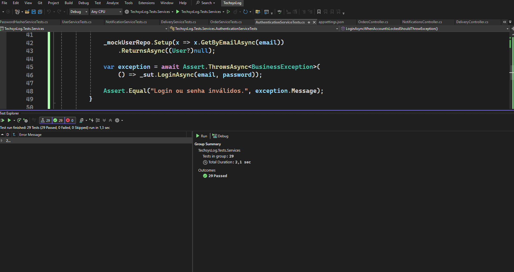

# 📖 TechsysLog - Documentação Completa (README + Testes)

<div align="center">


**Plataforma completa de logística com notificações em tempo real** 📦✨

</div>

---

## 📋 Índice

1. [Sobre o Projeto](#sobre-o-projeto)
2. [Stack Tecnológico](#stack-tecnológico)
3. [Estrutura do Projeto](#estrutura-do-projeto)
4. [Instalação e Setup](#instalação-e-setup)
5. [API Reference](#api-reference)
6. [SignalR - Notificações](#signalr---notificações-em-tempo-real)
7. [Arquitetura](#arquitetura)
8. [Segurança](#segurança)
9. [Testes Unitários](#testes-unitários)
10. [Como Rodar Testes](#como-rodar-os-testes)

---

## 📋 Sobre o Projeto

TechsysLog é uma plataforma web moderna para gerenciamento de pedidos e acompanhamento de entregas em tempo real. Desenvolvida com tecnologias de ponta, oferece uma experiência seamless para clientes e operadores logísticos.

### ✨ Destaques

- ✅ **Autenticação JWT** com Refresh Tokens para segurança máxima
- ✅ **Notificações em Tempo Real** via SignalR
- ✅ **API RESTful** bem documentada com OpenAPI/Swagger
- ✅ **Clean Architecture** com separação clara de responsabilidades
- ✅ **Integração com ViaCEP** para validação automática de endereços
- ✅ **Sistema de Roles** (Cliente, Operador, Admin)
- ✅ **Rastreamento de Histórico** de pedidos e entregas
- ✅ **Interface Responsiva** com Angular 16+
- ✅ **MongoDB** para flexibilidade e escalabilidade
- ✅ **28 Testes Unitários** com cobertura completa

---

## 🖼️ Galeria de Screenshots

### 🔐 Tela de Login

*Interface de autenticação com JWT - Acesso seguro para clientes e operadores*

### 📊 Dashboard do Cliente

*Painel principal do cliente mostrando histórico de pedidos com status em tempo real*

### 📱 Interface do Usuário

#### 👨‍💼 Dashboard do Operador

*Interface de gestão para operadores logísticos*

#### 🔔 Painel de Notificações

*Sistema de notificações em tempo real*

#### 📦 Criação de Pedido

*Formulário inteligente com busca de CEP automática*

#### 📦 Mudar Status de Pedido

*Alterar status do pedido*

#### 🚚 Efetuar Entrega

*Registrar entrega de pedido*

### 🔌 Backend e API

#### 📖 API Documentation - Swagger

*OpenAPI/Swagger com documentação completa*

#### ✅ Exemplo de Response - Criar Pedido

*Exemplo de resposta bem-sucedida*

#### 🗄️ Banco de Dados - MongoDB

*Mongo Express mostrando collections*

---

## 🛠️ Stack Tecnológico

### Backend
| Tecnologia | Versão | Propósito |
|-----------|--------|----------|
| **.NET Core** | 7.0+ | Framework principal |
| **Entity Framework Core** | Latest | ORM com MongoDB |
| **SignalR** | - | Comunicação em tempo real |
| **JWT Bearer** | - | Autenticação |
| **BCrypt.Net** | - | Hash seguro de senhas |
| **MongoDB** | Latest | Banco de dados NoSQL |
| **xUnit** | 2.6.6 | Testes Unitários |
| **Moq** | 4.20.70 | Mocking Framework |

### Frontend
| Tecnologia | Versão | Propósito |
|-----------|--------|----------|
| **Angular** | 16+ | Framework principal |
| **TypeScript** | Latest | Tipagem estática |
| **RxJS** | - | Programação reativa |
| **Tailwind CSS** | - | Estilização |
| **Angular SignalR** | - | Cliente realtime |

---

## 📦 Estrutura do Projeto

```
TechsysLog/
│
├── 📁 backend/
│   ├── 📁 src/
│   │   ├── 🎯 TechsysLog.Api/
│   │   │   ├── Controllers/          # Endpoints da API
│   │   │   ├── Middleware/           # Middleware customizado
│   │   │   ├── Extensions/           # Extensões de configuração
│   │   │   ├── appsettings.json
│   │   │   └── Program.cs
│   │   │
│   │   ├── 💼 TechsysLog.Application/
│   │   │   ├── Services/             # Lógica de negócios
│   │   │   ├── DTOs/                 # Data Transfer Objects
│   │   │   ├── Interfaces/           # Contratos de serviços
│   │   │   ├── Mappers/              # Mapeamento de entidades
│   │   │   ├── Hubs/                 # SignalR Hubs
│   │   │   └── Common/               # Classes compartilhadas
│   │   │
│   │   ├── 🏗️ TechsysLog.Domain/
│   │   │   ├── Entities/             # Entidades de negócios
│   │   │   ├── Enums/                # Enumerações
│   │   │   └── Interfaces/           # Contratos de repositório
│   │   │
│   │   └── 🔌 TechsysLog.Infrastructure/
│   │       ├── Data/
│   │       │   ├── Context/          # DbContext do MongoDB
│   │       │   ├── Configuration/    # configs
│   │       │   └── Common/           # Repository genérico
│   │       └── Repositories/         # Implementações
│   │
│   └── 📁 TechsysLog.Tests/
│       ├── 📁 Services/
│       │   ├── AuthenticationServiceTests.cs
│       │   ├── OrderServiceTests.cs
│       │   ├── DeliveryServiceTests.cs
│       │   ├── NotificationServiceTests.cs
│       │   ├── UserServiceTests.cs
│       │   ├── PasswordHasherServiceTests.cs
│       │   └── TokenServiceTests.cs
│       └── TechsysLog.Tests.csproj
│
├── 📁 frontend/TechsysLog.UI
│   ├── 📁 src/
│   │   ├── 📁 app/
│   │   │   ├── 🔐 core/
│   │   │   │   ├── services/
│   │   │   │   ├── guards/
│   │   │   │   └── interceptors/
│   │   │   ├── 📦 shared/
│   │   │   │   ├── components/
│   │   │   │   ├── pipes/
│   │   │   │   └── directives/
│   │   │   └── 🎨 features/
│   │   │       ├── auth/
│   │   │       ├── orders/
│   │   │       ├── deliveries/
│   │   │       └── notifications/
│   │   ├── assets/
│   │   └── styles.scss
│   └── angular.json
│
└── 📁 docs/
    ├── README.md
    └── RESUMO_TÉCNICO.md
```

---

## 🚀 Instalação e Setup

### Pré-requisitos

- **Node.js** 18+ com npm
- **.NET SDK** 7.0+
- **MongoDB** (local ou Atlas)
- **Git**
- **Docker** (opcional)

### 1️⃣ Clonar o Repositório

```bash
git clone https://github.com/luiscastrodev/TechsysLog.git
cd TechsysLog
```

### 2️⃣ Setup com Docker

```bash
docker-compose up -d
```

✅ Aplicação disponível em:
- **API**: https://localhost:7071/api
- **Frontend**: http://localhost:4200
- **Mongo Express**: http://localhost:8081 (admin/mongo123)

### 3️⃣ Setup Manual

#### Backend

```bash
cd backend

# Restaurar dependências
dotnet restore

# Configurar appsettings.json com MongoDB
# {
#   "ConnectionStrings": {
#     "MongoDb": "mongodb://localhost:27017/TechsysLogDB"
#   },
#   "Jwt": {
#     "Key": "sua-chave-secreta-super-segura-com-32-caracteres",
#     "Issuer": "TechsysLog",
#     "Audience": "TechsysLogUsers",
#     "ExpirationHours": 3
#   }
# }

# Rodar a API
dotnet run --project src/TechsysLog.Api
```

#### MongoDB

```bash
# Windows
net start MongoDB

# macOS
brew services start mongodb-community

# Linux
sudo systemctl start mongod

# Docker
docker run -d -p 27017:27017 --name mongodb mongo:latest
```

#### Frontend

```bash
cd frontend

# Instalar dependências
npm install

# Iniciar servidor de desenvolvimento
ng serve
```

✅ Frontend disponível em: **http://localhost:4200**

---

## 🔐 Configuração de Segurança

### JWT em appsettings.json

```json
{
  "ConnectionStrings": {
    "MongoDb": "mongodb://localhost:27017/TechsysLogDB"
  },
  "Jwt": {
    "Key": "sua-chave-secreta-super-segura-com-32-caracteres",
    "Issuer": "TechsysLog",
    "Audience": "TechsysLogUsers",
    "ExpirationHours": 3
  },
  "Cors": {
    "AllowedOrigins": ["http://localhost:4200"]
  }
}
```

---

## 📚 API Reference

### 🔑 Autenticação

#### Login
```http
POST /api/auth/login
Content-Type: application/json

{
  "login": "operador@techsyslog.com",
  "password": "Operador@123"
}
```

**Response (200):**
```json
{
  "isSuccess": true,
  "data": {
    "userId": "550e8400-e29b-41d4-a716-446655440000",
    "accessToken": "eyJhbGciOiJIUzI1NiIs...",
    "refreshToken": "k7x9mN2pQ...",
    "refreshTokenExpiresAt": "2024-01-19T10:30:00Z"
  }
}
```

#### Refresh Token
```http
POST /api/auth/refresh-token
Content-Type: application/json

{
  "token": "k7x9mN2pQ..."
}
```

### 📦 Pedidos

#### Criar Pedido
```http
POST /api/orders
Authorization: Bearer {accessToken}
Content-Type: application/json

{
  "description": "Smartphone Samsung S23",
  "amount": 2500.00,
  "address": {
    "zipCode": "01001-000",
    "number": "100",
    "neighborhood": "Sé",
    "street": "Praça da Sé",
    "city": "São Paulo",
    "state": "SP"
  }
}
```

#### Listar Meus Pedidos
```http
GET /api/orders
Authorization: Bearer {accessToken}
```

#### Listar Todos os Pedidos
```http
GET /api/orders/all
Authorization: Bearer {accessToken}
```

#### Alterar Status do Pedido
```http
PATCH /api/orders/{orderNumber}/status
Authorization: Bearer {accessToken}
Content-Type: application/json

{
  "newStatus": 1,
  "reason": "Pedido saiu para entrega"
}
```

**Status disponíveis:**
- `0` - Pendente
- `1` - Em Trânsito
- `2` - Saiu para Entrega
- `3` - Entregue
- `4` - Cancelado

### 🚚 Entregas

#### Registrar Entrega
```http
POST /api/delivery/register
Authorization: Bearer {accessToken}
Content-Type: application/json

{
  "orderNumber": "TECHSYS-1234567890",
  "userReceived": "João Silva",
  "notes": "Entregue sem problemas"
}
```

### 🔔 Notificações

#### Listar Notificações
```http
GET /api/notifications
Authorization: Bearer {accessToken}
```

#### Contar Não Lidas
```http
GET /api/notifications/unread-count
Authorization: Bearer {accessToken}
```

#### Marcar como Lida
```http
PATCH /api/notifications/{id}/read
Authorization: Bearer {accessToken}
```

---

## 📡 SignalR - Notificações em Tempo Real

### Conexão

```typescript
// Frontend (Angular)
import { Injectable } from '@angular/core';
import { HubConnectionBuilder } from '@microsoft/signalr';

@Injectable({ providedIn: 'root' })
export class NotificationService {
  private hubConnection = new HubConnectionBuilder()
    .withUrl('https://localhost:7071/notificationHub', {
      accessTokenFactory: () => this.getToken()
    })
    .withAutomaticReconnect()
    .build();

  constructor() {
    this.startConnection();
  }

  private startConnection() {
    this.hubConnection.start().catch(err => console.error(err));
    
    // Listeners
    this.hubConnection.on('ReceiveNotification', (notification) => {
      console.log('Notificação:', notification);
    });

    this.hubConnection.on('OrderStatusChanged', (data) => {
      console.log('Status alterado:', data);
    });

    this.hubConnection.on('OrderDelivered', (data) => {
      console.log('Pedido entregue:', data);
    });

    this.hubConnection.on('NewOrderCreated', (data) => {
      console.log('Novo pedido:', data);
    });
  }
}
```

### Eventos Disponíveis

| Evento | Descrição | Payload |
|--------|-----------|---------|
| `ReceiveNotification` | Notificação genérica | `{ title, message, type }` |
| `OrderStatusChanged` | Status do pedido alterado | `{ orderNumber, previousStatus, newStatus }` |
| `OrderDelivered` | Pedido entregue | `{ orderNumber, userReceived }` |
| `NewOrderCreated` | Novo pedido criado | `{ orderNumber }` |

---

## 🏗️ Arquitetura

### Clean Architecture em 4 Camadas

```
Apresentação (API Controllers)
         ↓
    Aplicação (Services, DTOs)
         ↓
      Domínio (Entidades, Enums)
         ↓
  Infraestrutura (Repositories, Context)
```

### Padrões Implementados

- ✅ **Repository Pattern** - Abstração de dados
- ✅ **Dependency Injection** - Inversão de controle
- ✅ **DTO Pattern** - Transferência de dados segura
- ✅ **Business Result** - Tratamento de erros consistente
- ✅ **Mapper Pattern** - Transformação de entidades
- ✅ **Generic Repository** - Reutilização de código

---

## 🔒 Segurança

### Implementado

- ✅ **JWT Bearer Token** com expiração configurável
- ✅ **Refresh Tokens** com revogação
- ✅ **BCrypt** para hash de senhas
- ✅ **CORS** restritivo
- ✅ **Authorization** por Roles
- ✅ **Account Lockout** após tentativas falhadas
- ✅ **Soft Delete** nas entidades

### Endpoints Protegidos

| Endpoint | Role Necessário |
|----------|-----------------|
| `GET /api/orders` | User |
| `GET /api/orders/all` | Operator, Admin |
| `PATCH /api/orders/{id}/status` | Operator, Admin |
| `POST /api/delivery/register` | Operator, Admin |
| `GET /api/notifications` | User |

### Seed de Dados

**Operador Padrão:**
- Email: `operador@techsyslog.com`
- Senha: `Operador@123`

**Usuários de Teste:**
- João Silva (joao.silva@email.com) - `User@123`
- Maria Oliveira (maria.o@email.com) - `User@123`
- Carlos Souza (carlos.souza@email.com) - `User@123`
- Ana Costa (ana.costa@email.com) - `User@123`

---

# 🧪 Testes Unitários

## 📦 Pacotes NuGet Necessários

### Instalação via Package Manager Console

```powershell
Install-Package xunit -Version 2.6.6
Install-Package xunit.runner.visualstudio -Version 2.5.6
Install-Package Moq -Version 4.20.70
Install-Package Microsoft.NET.Test.SDK -Version 17.8.2
Install-Package FluentAssertions -Version 6.12.0
```

### Instalação via CLI

```bash
dotnet add package xunit --version 2.6.6
dotnet add package xunit.runner.visualstudio --version 2.5.6
dotnet add package Moq --version 4.20.70
dotnet add package Microsoft.NET.Test.SDK --version 17.8.2
dotnet add package FluentAssertions --version 6.12.0
```

### Arquivo .csproj Completo

```xml
<?xml version="1.0" encoding="utf-8"?>
<Project Sdk="Microsoft.NET.Sdk">

  <PropertyGroup>
    <TargetFramework>net8.0</TargetFramework>
    <IsTestProject>true</IsTestProject>
    <Nullable>enable</Nullable>
  </PropertyGroup>

  <ItemGroup>
    <PackageReference Include="xunit" Version="2.6.6" />
    <PackageReference Include="xunit.runner.visualstudio" Version="2.5.6">
      <PrivateAssets>all</PrivateAssets>
      <IncludeAssets>runtime; build; native; contentfiles; analyzers; buildtransitive</IncludeAssets>
    </PackageReference>
    <PackageReference Include="Moq" Version="4.20.70" />
    <PackageReference Include="Microsoft.NET.Test.SDK" Version="17.8.2" />
    <PackageReference Include="FluentAssertions" Version="6.12.0" />
  </ItemGroup>

  <ItemGroup>
    <ProjectReference Include="..\TechsysLog.Application\TechsysLog.Application.csproj" />
    <ProjectReference Include="..\TechsysLog.Domain\TechsysLog.Domain.csproj" />
  </ItemGroup>

</Project>
```

## 📊 Detalhamento dos Pacotes

| Pacote | Versão | Propósito |
|--------|--------|----------|
| **xunit** | 2.6.6 | Framework de testes principal |
| **xunit.runner.visualstudio** | 2.5.6 | Integração com Visual Studio |
| **Moq** | 4.20.70 | Cria mocks das dependências |
| **Microsoft.NET.Test.SDK** | 17.8.2 | SDK para rodar testes |
| **FluentAssertions** | 6.12.0 | Asserts mais legíveis *(opcional)* |




## 🏗️ Padrão AAA (Arrange-Act-Assert)

```csharp
[Fact]
public async Task LoginAsyncWhenUserDoesntExistShouldThrowBusinessException()
{
    // 🔵 ARRANGE - Preparar dados
    var email = "ghost@example.com";
    var password = "senha123";

    _mockUserRepo.Setup(x => x.GetByEmailAsync(email))
        .ReturnsAsync((User?)null);

    // 🟢 ACT - Executar ação
    var exception = await Assert.ThrowsAsync<BusinessException>(
        () => _sut.LoginAsync(email, password));

    // 🟠 ASSERT - Verificar resultado
    Assert.Equal("Login ou senha inválidos.", exception.Message);
}
```

## 🔐 Testes de Autenticação - AuthenticationServiceTests

| Teste | O quê Testa | Esperado |
|-------|----------|----------|
| `LoginAsyncWhenUserDoesntExistShouldThrowBusinessException` | Validação de usuário existente | Exceção lançada |
| `LoginAsyncWhenAccountIsLockedShouldThrowException` | Bloqueio de conta | Exceção com data de desbloqueio |
| `LoginAsyncWhenPasswordIsWrongShouldRegisterFailedAttempt` | Incremento de tentativas | UpdateAsync chamado 1x |
| `LoginAsyncWithValidCredentialsShouldReturnTokens` | Login bem-sucedido | Tokens gerados |
| `RegisterFailedLoginAsyncWhenMaxAttemptsReachedShouldLockAccount` | Lockout automático | Conta bloqueada |
| `UnlockUserAsyncShouldClearLockoutAndResetAttempts` | Desbloqueio | LockoutEnd é null |
| `RefreshTokenAsyncWhenTokenIsExpiredShouldReturnFailure` | Token expirado | Falha com mensagem |
| `RefreshTokenAsyncWithValidTokenShouldGenerateNewAccessToken` | Refresh bem-sucedido | Novo token gerado |

## 📦 Testes de Pedidos - OrderServiceTests

| Teste | O quê Testa | Esperado |
|-------|----------|----------|
| `CreateOrderAsyncWhenAddressNotFoundShouldThrow` | CEP inválido | Exceção lançada |
| `CreateOrderAsyncShouldCreateNotificationAndBroadcastViaSignalR` | Criar pedido completo | Pedido, notificação, broadcast |
| `GetUserOrdersAsyncShouldReturnOrdersWithHistory` | Listar pedidos | Lista com histórico |
| `GetByNumberAsyncWhenOrderNotFoundShouldReturnNull` | Pedido inexistente | Retorna null |
| `ChangeOrderStatusAsyncShouldCreateHistoryAndNotifyUser` | Mudar status | Histórico, notificação, broadcast |

## 🚚 Testes de Entrega - DeliveryServiceTests

| Teste | O quê Testa | Esperado |
|-------|----------|----------|
| `RegisterDeliveryAsyncWhenOrderNotFoundShouldThrow` | Pedido inexistente | Exceção lançada |
| `RegisterDeliveryAsyncShouldMarkOrderAsDeliveredAndNotifyCustomer` | Registrar entrega | Ordem marcada, notificação enviada |
| `RegisterDeliveryAsyncWithNotesShouldIncludeNotesInDelivery` | Incluir anotações | Notas salvas |

## 🔔 Testes de Notificações - NotificationServiceTests

| Teste | O quê Testa | Esperado |
|-------|----------|----------|
| `GetUserNotificationsAsyncShouldReturnUserNotifications` | Listar notificações | Lista completa |
| `GetUnreadCountAsyncShouldReturnCorrectCount` | Contar não lidas | Número correto |
| `MarkAsReadAsyncShouldMarkNotificationAsRead` | Marcar como lida | Repository chamado |
| `MarkAllAsReadAsyncShouldMarkAllUserNotificationsAsRead` | Marcar todas | Repository chamado |

## 👤 Testes de Usuário - UserServiceTests

| Teste | O quê Testa | Esperado |
|-------|----------|----------|
| `RegisterAsyncWhenEmailAlreadyExistsShouldThrow` | Email duplicado | Exceção lançada |
| `RegisterAsyncWithNewEmailShouldCreateUser` | Novo usuário | Usuário criado |
| `GetByIdAsyncWhenUserExistsShouldReturnUser` | Buscar usuário | Usuário encontrado |
| `GetByIdAsyncWhenUserDoesntExistShouldReturnFailure` | Usuário inexistente | Falha retornada |
| `GetAllAsyncShouldReturnAllUsers` | Listar todos | Lista completa |

## 🔐 Testes de Hash - PasswordHasherServiceTests

| Teste | O quê Testa | Esperado |
|-------|----------|----------|
| `HashPasswordShouldReturnDifferentHashEachTime` | Segurança BCrypt | Hashes diferentes |
| `VerifyPasswordShouldReturnTrueForCorrectPassword` | Senha correta | Retorna true |
| `VerifyPasswordShouldReturnFalseForIncorrectPassword` | Senha incorreta | Retorna false |
| `VerifyPasswordShouldReturnFalseForMalformedHash` | Hash inválido | Retorna false |

## 📊 Resumo de Cobertura

| Service | Testes | Cenários |
|---------|--------|----------|
| **AuthenticationService** | 8 | Login, Lockout, Tokens, Unlock |
| **OrderService** | 5 | Criação, Listagem, Status, Endereço |
| **DeliveryService** | 3 | Registro, Notificação, Notas |
| **NotificationService** | 4 | Listagem, Contagem, Marcação |
| **UserService** | 5 | Registro, Busca, Email Duplicado |
| **PasswordHasherService** | 4 | Hash, Verificação, Segurança |
| **TOTAL** | **28 testes** | **Cobertura ampla** |

---

## 🚀 Como Rodar os Testes

### Via Visual Studio

1. **Abrir Test Explorer:** `Test → Test Explorer` ou `Ctrl+E, T`
2. **Clicar em "Run All"** para executar todos
3. **Ou selecionar teste específico** e clicar "Run"

### Via CLI

```bash
# Rodar todos os testes
dotnet test

# Rodar com verbosidade
dotnet test --verbosity normal

# Rodar teste específico
dotnet test --filter "LoginAsyncWhenUserDoesntExistShouldThrowBusinessException"

# Gerar coverage report
dotnet test /p:CollectCoverageMetrics=true
```

### Via PowerShell

```powershell
# Rodar e exibir resultado
dotnet test -c Release

# Rodar com reporter detalhado
dotnet test --logger "console;verbosity=detailed"
```

## 📈 Output Esperado

```
Starting test run for TechsysLog.Tests.csproj

  AuthenticationServiceTests
    ✓ LoginAsyncWhenUserDoesntExistShouldThrowBusinessException
    ✓ LoginAsyncWhenAccountIsLockedShouldThrowException
    ✓ LoginAsyncWhenPasswordIsWrongShouldRegisterFailedAttempt
    ✓ LoginAsyncWithValidCredentialsShouldReturnTokens
    ✓ RegisterFailedLoginAsyncWhenMaxAttemptsReachedShouldLockAccount
    ✓ UnlockUserAsyncShouldClearLockoutAndResetAttempts
    ✓ RefreshTokenAsyncWhenTokenIsExpiredShouldReturnFailure
    ✓ RefreshTokenAsyncWithValidTokenShouldGenerateNewAccessToken

  OrderServiceTests
    ✓ CreateOrderAsyncWhenAddressNotFoundShouldThrow
    ✓ CreateOrderAsyncShouldCreateNotificationAndBroadcastViaSignalR
    ✓ GetUserOrdersAsyncShouldReturnOrdersWithHistory
    ✓ GetByNumberAsyncWhenOrderNotFoundShouldReturnNull
    ✓ ChangeOrderStatusAsyncShouldCreateHistoryAndNotifyUser

  DeliveryServiceTests
    ✓ RegisterDeliveryAsyncWhenOrderNotFoundShouldThrow
    ✓ RegisterDeliveryAsyncShouldMarkOrderAsDeliveredAndNotifyCustomer
    ✓ RegisterDeliveryAsyncWithNotesShouldIncludeNotesInDelivery

  NotificationServiceTests
    ✓ GetUserNotificationsAsyncShouldReturnUserNotifications
    ✓ GetUnreadCountAsyncShouldReturnCorrectCount
    ✓ MarkAsReadAsyncShouldMarkNotificationAsRead
    ✓ MarkAllAsReadAsyncShouldMarkAllUserNotificationsAsRead

  UserServiceTests
    ✓ RegisterAsyncWhenEmailAlreadyExistsShouldThrow
    ✓ RegisterAsyncWithNewEmailShouldCreateUser
    ✓ GetByIdAsyncWhenUserEx
